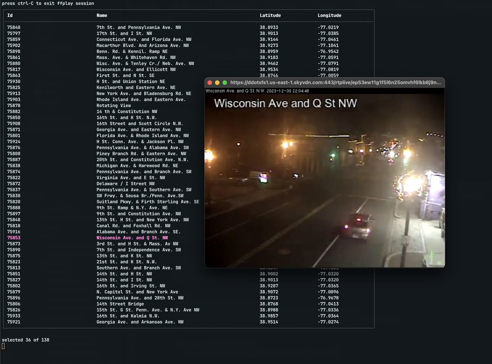

# ddot-cli

One of my favorite open datasets is Washington DC's open traffic cameras. They have a funky architecture, which you can reverse engineer from viewing
DevTools network table for https://www.dctrafficinfo.org/

I wanted to get some reps in with [BubbleTea](https://github.com/charmbracelet/bubbletea), so here's a CLI that lets you browse all available CCTV cameras.

## DDOT Architecture

DDOT hosts a MQTT instance on AWS. By looking at the WebSocket messages, you can see that

* The credentials are passed in plaintext, username `dcdot` and password `cctvddotpublic`
* The MQTT broker has a topic `DDOT/Cameras` that, when you connect, will dump a gigantic JSON blob with data for all registered cameras
* There are various other topics but I don't currently use them. Things like `DDOT/Incidents`, `DDOT/AVL`, `DDOT/PavementSensors`... there's a lot here

Each camera has an HLS playlist that lets you tap into its live stream. I'm just shelling out to `ffplay` to do this in the CLI, but you can also transcode and record the stream, etc.

## TODO

- [ ] Add command for recording the stream to disk
- [ ] Add command for running object detection over frames in the stream
